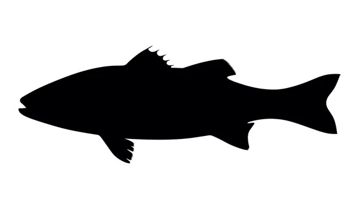
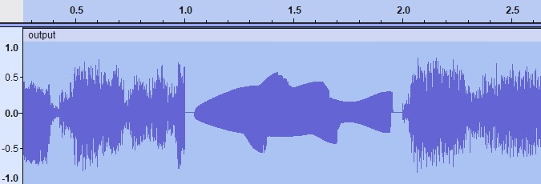

# DraWAVE 

Apply custom envelope shapes to audio segments using black and white images. This tool allows you to reshape audio waveforms to match visual patterns, creating unique sound design effects.

## Features

- Transform audio segments using envelope shapes from images
- Apply vertical offsets to envelope images
- Fill concavities in envelope shapes for smoother results
- Precise control over start time and duration

## Examples

A black and white image of a fish:

[](## "Original image") 


The resulting waveform:

[](## "Result waveform")  


## Installation

```bash
git clone https://github.com/dobrosketchkun/DraWAVE.git
cd DraWAVE
pip install numpy scipy pillow
```

## Usage

```bash
python drawave.py input.wav image.png 3.5 --duration 1.2 --output out.wav --img_offset -10
```

### Parameters

- `input.wav`: Input audio file
- `envelope.png`: Black and white image defining the envelope shape
- `3.5`: Start time in seconds where the envelope will be applied
- `--duration 1.2`: Duration in seconds for the envelope application (default: 1.0)
- `--output out.wav`: Output file path (default: output.wav)
- `--img_offset -10`: Vertical pixel offset for the envelope image (default: 0)
- `--fill`: Apply concavity filling (default: True)
- `--window 7`: Window size for concavity filling (default: 7)

## How It Works

1. The tool extracts top and bottom envelope curves from a black and white image
2. It applies the Hilbert transform to extract the instantaneous phase of the audio
3. The original audio waveform is remapped to fit within the extracted envelope


